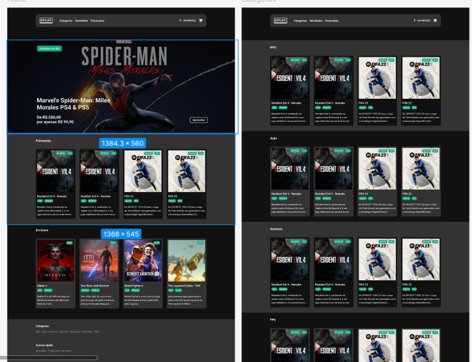

<!DOCTYPE html>
<html lang="pt-br">
<head>
    <meta charset="UTF-8">
    <meta name="viewport" content="width=device-width, initial-scale=1.0">
    <meta name="description" content="Catálogo de jogos desenvolvido em React">
    <meta name="keywords" content="React, TypeScript, Jogos, Catálogo">
    <meta name="author" content="Ana Alice Rodrigues">

</head>
<body style="font-family: Arial, sans-serif; line-height: 1.6; margin: 20px; padding: 0;">

<header>
    <h1>EPLAY - Catálogo de Jogos</h1>
    
</header>

    
Índice

    <ol>
        <li><a href="#sobre-o-projeto">Sobre o projeto</a></li>
        <li><a href="#parte-tecnica">Parte Técnica</a></li>
        <li><a href="#estrutura-dos-arquivos">Estrutura dos Arquivos</a></li>
        <li><a href="#casos-de-uso">Casos de Uso</a></li>
        <li><a href="#ferramentas">Ferramentas</a></li>
        <li><a href="#scripts-disponiveis">Scripts Disponíveis</a></li>
        <li><a href="#contato">Contato</a></li>
    </ol>

<section id="sobre-o-projeto">
    <h2>Sobre o projeto</h2>
    

        Bem-vindo ao repositório do EPLAY, um projeto de catálogo de jogos desenvolvido em React com TypeScript. Este projeto exibe uma lista de jogos com várias categorias e inclui funcionalidades como pesquisa, visualização de detalhes do produto e um carrinho de compras.
    

    

        Proposta de Valor: Oferecer uma experiência de compra conveniente, com uma seleção diversificada de jogos, facilidade de navegação e processos de compra eficientes.
    

</section>

<section id="parte-tecnica">
    <h2>Parte Técnica</h2>
    <ul>
        <li><strong>Frontend:</strong> React com TypeScript é usado para criar uma interface de usuário dinâmica e responsiva. Styled Components são utilizados para estilização dos componentes. React Router é usado para gerenciamento de rotas.</li>
        <li><strong>Controle de Qualidade:</strong> ESLint e Prettier são utilizados para garantir a qualidade do código e um estilo consistente.</li>
    </ul>
</section>

<section id="estrutura-dos-arquivos">
    <h2>Estrutura dos Arquivos</h2>
    <pre style="background-color: #f4f4f4; padding: 10px; border: 1px solid #ddd; overflow-x: auto;">
<code>
EPLAY/
├── .vscode/
├── node_modules/
├── public/
├── src/
│   ├── assets/
│   ├── components/
│   │   ├── Banner/
│   │   ├── Button/
│   │   ├── Card/
│   │   ├── Cart/
│   │   ├── Footer/
│   │   ├── Gallery/
│   │   ├── Header/
│   │   ├── Hero/
│   │   ├── Loader/
│   │   ├── Product/
│   │   ├── ProductsList/
│   │   ├── Section/
│   │   └── Tag/
│   ├── pages/
│   │   ├── Categories/
│   │   ├── Checkout/
│   │   ├── Home/
│   │   └── Product/
│   ├── services/
│   ├── store/
│   ├── utils/
│   ├── App.tsx
│   ├── index.tsx
│   ├── react-app-env.d.ts
│   ├── reportWebVitals.ts
│   ├── routes.tsx
│   ├── setupTests.ts
│   ├── styles.ts
│   └── ...
├── .editorconfig
├── .eslintrc.json
├── .gitignore
├── .prettierrc
├── package-lock.json
├── package.json
├── README.md
└── tsconfig.json
</code>
    </pre>
</section>

<section id="casos-de-uso">
    <h2>Casos de Uso</h2>
    <ul>
        <li>Exibição de jogos por categorias</li>
        <li>Pesquisa de jogos</li>
        <li>Visualização dos detalhes do produto</li>
        <li>Adição de jogos ao carrinho de compras</li>
    </ul>
</section>

<section id="ferramentas">
    <h2>Ferramentas</h2>
    <ul>
        <li></li>
        <li></li>
        <li></li>
        <li></li>
        <li></li>
        <li></li>
        <li></li>
        <li></li>
    </ul>
</section>

<section id="scripts-disponiveis">
    <h2>Scripts Disponíveis</h2>
    
Este projeto foi inicializado com Create React App.

    <h3>npm start</h3>
    
Executa o aplicativo no modo de desenvolvimento. 
    Abra <a href="http://localhost:3000" target="_blank">http://localhost:3000</a> para visualizar no navegador.

    
A página recarregará se você fizer edições. 
    Você também verá quaisquer erros de lint no console.

    <h3>npm test</h3>
    
Inicia o executor de testes no modo interativo de observação. 
    Veja a seção sobre <a href="https://create-react-app.dev/docs/running-tests" target="_blank">executar testes</a> para mais informações.

    <h3>npm run build</h3>
    
Compila o aplicativo para produção na pasta <code>build</code>. 
    Ele agrupa corretamente o React no modo de produção e otimiza a construção para o melhor desempenho.

    
A construção é minimizada e os nomes dos arquivos incluem os hashes. 
    Seu aplicativo está pronto para ser implantado! 
    Veja a seção sobre <a href="https://create-react-app.dev/docs/deployment" target="_blank">implantação</a> para mais informações.

    <h3>npm run eject</h3>
    
Nota: esta é uma operação sem retorno. Uma vez que você <code>eject</code>, não pode voltar atrás!

    
Se você não estiver satisfeito com a ferramenta de construção e as escolhas de configuração, pode <code>eject</code> a qualquer momento. Este comando removerá a dependência de construção única do seu projeto.

    
Em vez disso, copiará todos os arquivos de configuração e as dependências transitivas (webpack, Babel, ESLint, etc.) diretamente para o seu projeto, para que você tenha controle total sobre eles. Todos os comandos, exceto <code>eject</code>, ainda funcionarão, mas apontarão para os scripts copiados para que você possa ajustá-los. Neste ponto, você está por conta própria.

    
Você nunca precisa usar <code>eject</code>. O conjunto de recursos curados é adequado para pequenas e médias implantações, e você não deve se sentir obrigado a usar este recurso. No entanto, entendemos que esta ferramenta não seria útil se você não pudesse personalizá-la quando estivesse pronto para isso.

    <h3>Saiba Mais</h3>
    
Você pode aprender mais na <a href="https://create-react-app.dev/docs/getting-started" target="_blank">documentação do Create React App</a>.

    
Para aprender React, consulte a <a href="https://reactjs.org/" target="_blank">documentação do React</a>.

</section>

<section id="contato">
    <h2>Contato</h2>
    <ul>
         <li></li>
         <li><a href="https://eplay-ivory.vercel.app/ " target="_blank"> clique para acessar o projeto</a></li>
    </ul>
</section>
</body>
</html>
